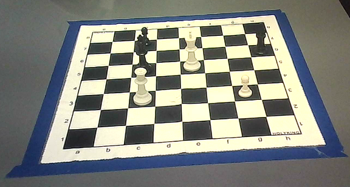

# Chess Vision System

## Overview

Standalone computer vision system for chess board detection, piece recognition, and FEN generation. This system processes camera feeds to detect chess boards, identify pieces using per-square classification (PyTorch transfer learning), and generate FEN notation.

## Camera Setup in Real World

Make sure that the camera view is similar to this, a1 is at the bottom left, h1 is at the bottom right, a8 is at the top left of the board, and h8 is at the top right.



## Quick Start

### Setup Environment

```bash

conda create -n jph python=3.10
conda activate jph
pip install -r requirements.txt
```

### Run Vision Pipeline

```bash
python3 run.py --live --camera 0        # Live
```

First you will need to calibrate the camera , so select the calibration option and follow the instructions.

After calibration you select the live camera detection for chess detection.

Some important hot keys are:

1. m: to switch between different detection methods
2. o: to move to auto method for detection

## Vision Pipeline

### Main Entry Point

- **`run.py`** - Main vision processing script

### Core Components

#### Board Detection (`src/vision/enhanced_chessboard_detector.py`)

Multiple detection methods with automatic fallback:

- `combined_robust` - Primary method combining best techniques
- `yolo_contour` - YOLO + contour detection
- `opencv_chessboard` - OpenCV chessboard detection
- `contour_adaptive` - Adaptive contour method
- `edge_based` - Edge + morphology detection
- `harris_lines` - Harris corners + hull
- `gradient_hough` - Gradient-informed Hough transform
- `line_intersection` - Polar Hough + intersections
- `morphological` - Morphology-based edges

#### Homography Transformation (`src/vision/enhanced_homography_transformer.py`)

- Perspective correction for bird's-eye view
- Board coordinate mapping
- Camera distortion correction

#### Calibration System (`src/vision/enhanced_calibration_system.py`)

- Camera calibration (intrinsic parameters)
- Board corner selection (interactive)
- Persistent calibration storage

#### FEN Generation (`src/vision/pipeline/fen_pipeline.py`)

- Converts piece detections to FEN notation
- Maps pieces to chess squares (a1-h8)
- Handles piece label mapping

#### Fallback Detection (`src/vision/fallback_detection_system.py`)

- Movement-based piece detection
- Heatmap analysis
- Used when piece detection fails or is incomplete

#### Camera Utilities (`src/vision/camera_utils.py`)

- Camera initialization and management
- Cross-platform camera support

### Additional Vision Modules

- `src/vision/integrated_chess_detector.py` - Integrated detector combining all components
- `src/vision/hybrid_chess_detector.py` - Hybrid detection approach
- `src/vision/fallback_chess_detector.py` - Fallback piece detection
- `src/vision/enhanced_vision_pipeline.py` - Enhanced pipeline with fallbacks
- `src/vision/live_chess_detection.py` - Live detection utilities
- `src/vision/chess_state_validator.py` - Chess state validation

## Hotkeys (Live Mode)

| Key         | Action                                              |
| ----------- | --------------------------------------------------- |
| `q` / `ESC` | Quit application                                    |
| `s`         | Manual frame capture                                |
| `t`         | Capture 64 tiles for training data (label with FEN) |
| `a`         | Toggle auto-capture (every 3 seconds)               |
| `c`         | Toggle corner overlay visualization                 |
| `p`         | Toggle piece overlay visualization                  |
| `m`         | Cycle through detection methods                     |
| `o`         | Reset to auto detection method                      |
| `[`         | Decrease confidence threshold                       |
| `]`         | Increase confidence threshold                       |
| `r`         | Recalibrate camera and board                        |
| `k`         | Interactive corner mapping                          |
| `u`         | Use saved calibration (disable method override)     |
| `g`         | Stop game (if gameplay components available)        |

## Usage

### Live Camera Detection

```bash
python3 run.py --live --camera 0
```

- Real-time board detection and piece recognition
- Automatic frame processing every 3 seconds (toggle with 'a')
- Manual capture with 's' key
- Multi-panel display showing:
  - Original camera feed
  - Detected corners
  - Bird's-eye view
  - Piece detections
  - FEN notation

### Camera Calibration

```bash
python3 run.py --calibrate
```

- Interactive camera calibration
- Manual board corner selection
- Saves calibration to `config/calibration/`

### Static Image Processing

```bash
python3 run.py --static
```

- Process images from `test_results/` directory
- Batch processing mode
- Generates detection outputs

## Configuration

### Calibration Data

- `config/calibration/camera_calibration.json` - Camera intrinsic parameters
- `config/calibration/board_corners.json` - Board corner coordinates and homography

### Piece Classifier Model

- `Model/piece_classifier.pt` - Trained piece classifier (EfficientNet-B0, train with `train_transfer_learning.py`)

### Settings

- `config/settings.yaml` - System settings

## YOLO Training

### Dataset

- `data/chess_dataset/` - Complete YOLO training dataset
  - `data.yaml` - Dataset configuration
  - `roboflow/` - Training/validation/test splits
  - `tools/` - Training scripts

### Train Model

```bash
cd data/chess_dataset/tools
python3 train_v8.py
```

### Transfer Learning (Piece Classifier)

- `train_transfer_learning.py` - Train EfficientNet-B0 on per-square data
- `capture_training_data.py` - Capture bird's-eye tiles for manual labeling
- `organize_captured_tiles.py` - Organize captured tiles using FEN

### YOLO Training Scripts

- `train_v8.py` - Main training script
- `predict_v8.py` - Prediction script
- `verify_labels.py` - Label verification
- `audit_labels.py` - Label auditing
- `clean_labels_strict.py` - Label cleaning
- `fen_from_image.py` - FEN from image utility
- `image_to_fen.py` - Image to FEN conversion
- `warp_board.py` - Board warping utility
- `make_aruco.py` - ArUco marker generation
- `fix_labels.py` - Label fixing utility

## Output Directories

- `test_results/` - Vision processing outputs
  - `live_detection/` - Live detection results
  - `camera_calibration/` - Calibration outputs
- `gameplay_data/` - Frame data storage (if used)
- `vision_data/` - Vision data storage (if used)

## Piece Classification (Transfer Learning)

Piece detection uses **per-square classification** with PyTorch transfer learning:

1. **Split** the bird's-eye view into 64 tiles with **top overlap** (to capture piece tops that get cut off).
2. **Classify** each tile with EfficientNet-B0 (or ResNet18/MobileNetV3).
3. **Assemble** 64 predictions into FEN notation.

YOLO has been removed. See **[MIGRATION_PLAN.md](MIGRATION_PLAN.md)** for dataset and training details.

### New Module: `piece_classifier/`

- `board_splitter.py` – Splits board into 64 tiles with configurable overlap (implemented).
- `model_wrapper.py` – PyTorch model inference (to implement).
- `fen_from_classifier.py` – Assembles piece_map → FEN (to implement).

### Quick Start: Board Splitter

```python
from vision.piece_classifier import split_board_into_tiles

tiles = split_board_into_tiles(
    warped_board,
    top_overlap=0.2,   # 20% overlap upward to capture piece tops
    tile_size=64,      # Resize for model input
)
# tiles[0].square == "a8", tiles[63].square == "h1"
```

---

## Project Structure

```
sd07_joseph_hoane_1/
├── run.py                          # Main vision script
├── requirements.txt                # Python dependencies
│
├── Model/
│   └── Retrained_best.pt          # YOLO weights
│
├── config/
│   ├── calibration/               # Calibration data
│   │   ├── camera_calibration.json
│   │   └── board_corners.json
│   └── settings.yaml
│
├── data/
│   └── chess_dataset/             # YOLO dataset
│       ├── data.yaml
│       ├── roboflow/
│       └── tools/                 # Training scripts
│
├── src/
│   └── vision/                    # Vision modules
│       ├── piece_classifier/      # Per-square classifier (transfer learning)
│       │   ├── board_splitter.py  # Split board into 64 tiles with overlap
│       │   └── ...
│       ├── enhanced_chessboard_detector.py
│       ├── enhanced_homography_transformer.py
│       ├── enhanced_calibration_system.py
│       ├── pipeline/
│       │   └── fen_pipeline.py
│       ├── fallback_detection_system.py
│       ├── camera_utils.py
│       └── [other vision files]
│
└── test_results/                  # Output directory
```

## Troubleshooting

### Camera Not Detected

```bash
ls /dev/video*
python3 run.py --live --camera 0
python3 run.py --live --camera 1
sudo usermod -a -G video $USER
```

### Calibration Issues

- Ensure good lighting
- Board should be clearly visible
- Use 'k' key for interactive corner mapping
- Recalibrate with 'r' key if detection is unstable

### Piece Detection Issues

- Adjust confidence threshold with `[` and `]` keys
- Try different detection methods with 'm' key
- Verify piece classifier exists: `Model/piece_classifier.pt` (run `train_transfer_learning.py` to train)

### Vision Pipeline Issues

- Verify calibration data exists in `config/calibration/`
- Check camera permissions
- Ensure dependencies are installed: `pip install -r requirements.txt`
